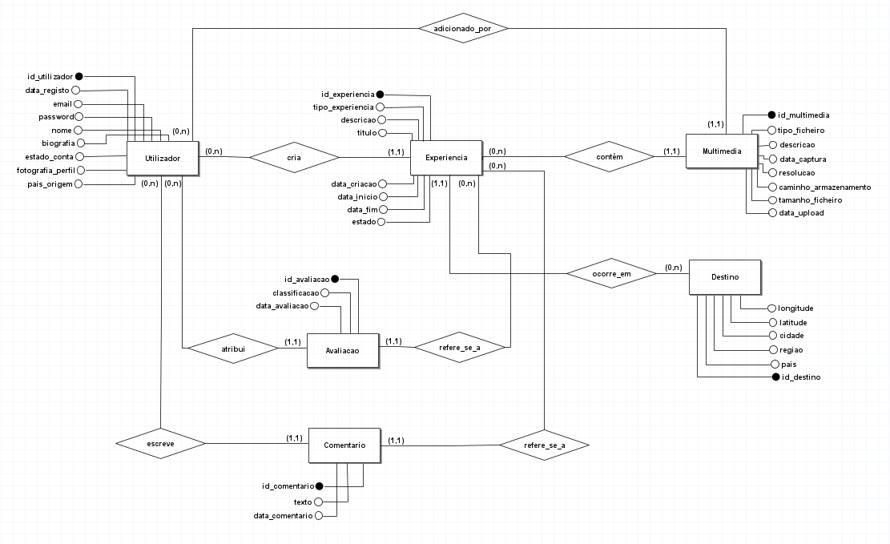
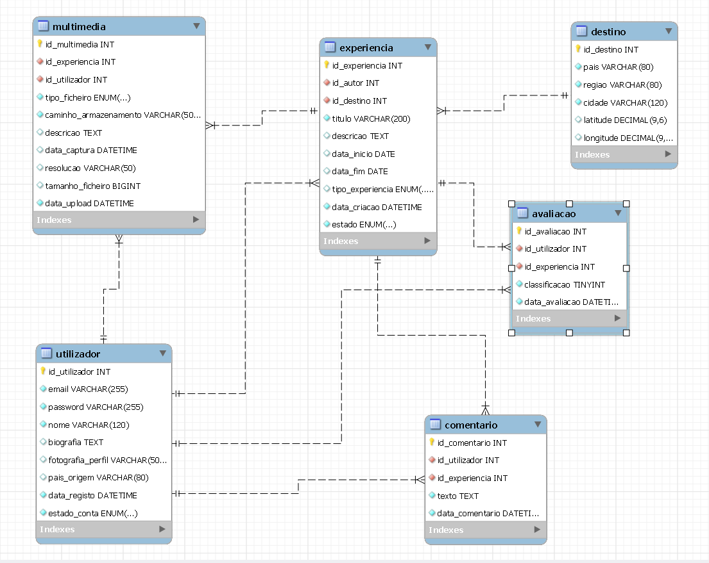

<div align="center">
<h1>🗺️ ᗰᗩᑭᗩ ᗪE ᗰEᗰóᖇIᗩꌗ</h1>
<h3>Relational Database System for Travel Cataloguing</h3>


*Academic project developed for **Bases de Dados** @ University of Minho*  
*Final grade: **17/20** ⭐*

</div>

---

## 🧳 About

A full relational database system designed for **Sofia**, a passionate traveller who needed a structured way to store, organise and revisit her travel memories across photos, videos and personal notes.

The system was designed and implemented from scratch: from requirements analysis and interviews with the client, through ER modelling, relational schema normalisation and full MySQL implementation with queries, views, indexes, procedures and triggers.

---

## 📐 Conceptual Model



---

## 🗃️ Logical Model



---

## ⚡ Features

- **ER diagram** - entity-relationship model designed from real user requirements
- **Relational schema** - normalised to Third Normal Form (3NF)
- **Relational algebra** - queries validated before SQL implementation
- **MySQL implementation** - full physical model with InnoDB engine and UTF-8 support
- **10 analytical queries** - covering search, filtering, ranking and aggregation
- **6 views** - pre-built perspectives for common access patterns
- **Optimised indexing** - composite indexes aligned with query access patterns
- **Stored procedures** - business logic encapsulated server-side
- **Triggers** - data integrity enforced at database level
- **Role-based access control** - admin, app and readonly roles with least-privilege principle

---

## 🗂️ Data Model

| Entity | Description |
|---|---|
| `UTILIZADOR` | Users with profile, biography and account status |
| `DESTINO` | Travel destinations with geographic coordinates |
| `EXPERIENCIA` | Travel experiences authored by users |
| `MULTIMEDIA` | Photos, videos and audio files linked to experiences |
| `COMENTARIO` | User comments on experiences |
| `AVALIACAO` | Ratings (0–5) per user per experience |

---

## 📁 File Structure

```
travel-memories-database/
├── modelo-conceptual/
│   └── MapaDeMemorias_MapaConceitual.png
├── modelo-logico/
│   ├── ModeloLogico.png
│   └── DIAGRAMA-EER.mwb
├── relaX/
│   └── relaX.txt
├── sql/
│   ├── BD_MapaDeMemorias.sql
│   ├── E.InterrogacoesSQL.sql
│   ├── F.CriacaoBD.sql
│   ├── G.Povoamento.sql
│   ├── H.Views.sql
│   ├── I.Permissoes.sql
│   ├── J.Indices.sql
│   ├── K.Triggers.sql
│   └── queries.sql
├── G16 BD2526.pdf
└── README.md
```

---

## 🚀 How to Run

```bash
# Create the database and tables
mysql -u root -p < sql/F.CriacaoBD.sql

# Populate the database
mysql -u root -p < sql/G.Povoamento.sql

# Load views
mysql -u root -p < sql/H.Views.sql

# Load indexes
mysql -u root -p < sql/J.Indices.sql

# Load procedures, functions and triggers
mysql -u root -p < sql/K.Triggers.sql

# Set up users and permissions
mysql -u root -p < sql/I.Permissoes.sql

# Run analytical queries
mysql -u root -p MapaDeMemorias < sql/E.InterrogacoesSQL.sql
```

---

## 🛠️ Tech Stack

`MySQL` · `SQL` · `ER Modelling` · `Relational Algebra` · `3NF Normalisation` · `Stored Procedures` · `Triggers` · `Role-Based Access Control`

---

## 👩‍💻 Authors

**Carolina Dias** — [@carolinavdias](https://github.com/carolinavdias)  
**António Barroso**  
**Gabriel Carvalho**  
**Gustavo Silva**
